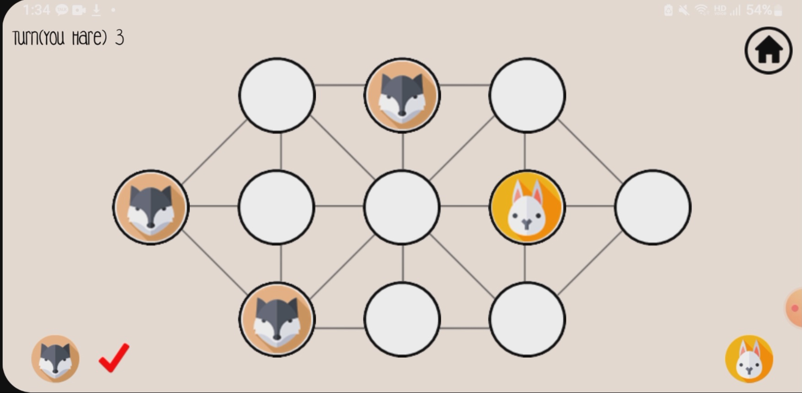

# HareAndHounds
한양대학교ERICA "모바일로봇의이해"에서 진행 된 휴림로봇 기업 연계 프로젝트 Hare And Hounds 입니다.

## 개발환경

 
-3DDC84)

## 애플리케이션 화면

  
  
  

## 시연 영상

왼쪽 하단 : Player1(Hounds)
오른쪽 하단 : Player2(Hare)

각각의 서로 다른 모바일에서 진행된 영상 입니다.